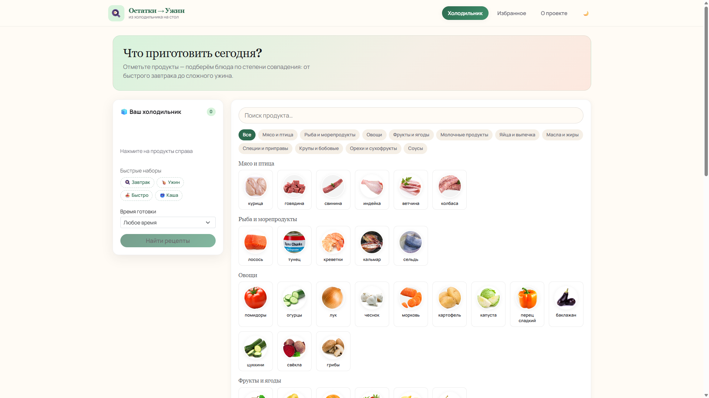
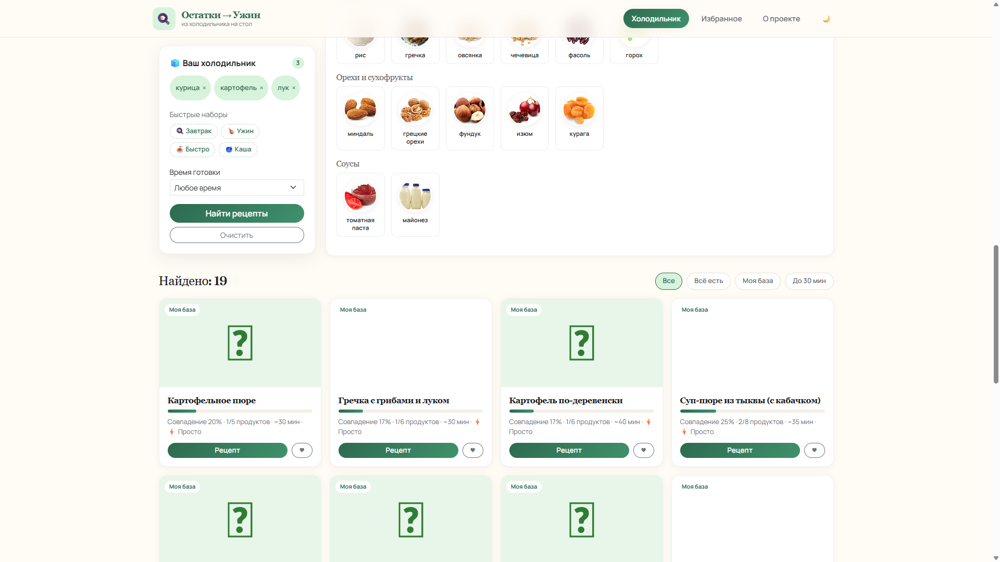

# Остатки → Ужин

[](https://www.python.org/)
[](https://www.djangoproject.com/)
[](https://ostratki-uzhin.onrender.com/)

Демо-сервис «что приготовить из того, что есть в холодильнике». Проект портфолио на Django.

**Live demo:** https://ostratki-uzhin.onrender.com  
**Репозиторий:** https://github.com/Alexandr-mailru/ostratki-uzhin



## О проекте (кейс)

Задача — показать полноценный веб-сервис: от UI до интеграции с внешним API и юридической обвязки для публичного демо.

**Что реализовано:**
- каталог из 69 продуктов с реальными фото и категориями;
- гибридный поиск: локальная база (31 рецепт на русском) + Spoonacular API;
- сортировка по % совпадения ингредиентов, фильтры «Всё есть» / «До 30 мин»;
- избранное в сессии, экспорт рецепта в PDF;
- тёмная и светлая тема, адаптив для мобильных;
- cookie-баннер, политика конфиденциальности и авторские права (ФЗ‑152).

**Стек:** Python 3.12 · Django 5.2 · SQLite · Bootstrap 5 · Spoonacular API · xhtml2pdf · Gunicorn · WhiteNoise

> Демо работает **без API-ключа** — достаточно локальной базы. Ключ Spoonacular опционален для расширенного поиска.

## Скриншоты

| Главная | Результаты поиска |
|---------|-------------------|
|  |  |

## Быстрый старт

```bash
git clone https://github.com/Alexandr-mailru/ostratki-uzhin.git
cd ostratki-uzhin
python -m venv .venv
.venv\Scripts\activate          # Windows
# source .venv/bin/activate     # Linux / macOS
pip install -r requirements.txt
copy .env_sample .env           # заполните SPOONACULAR_API_KEY (опционально)
python manage.py migrate
python manage.py seed_catalog --cache-photos
python manage.py runserver
```

Откройте http://127.0.0.1:8000/

## Переменные окружения

| Переменная | Описание |
|------------|----------|
| `SECRET_KEY` | Секрет Django |
| `DEBUG` | `True` для разработки |
| `SPOONACULAR_API_KEY` | Ключ [Spoonacular](https://spoonacular.com/food-api) (опционально) |
| `ALLOWED_HOSTS` | Хосты через запятую (для продакшена) |
| `CSRF_TRUSTED_ORIGINS` | HTTPS-ориджины через запятую |

## Команды

- `python manage.py seed_catalog --cache-photos` — 69 продуктов с фото и 31 рецепт;
- `python manage.py cache_product_photos` — обновить кэш фото;
- `python manage.py test recipes` — запуск тестов.

## Деплой на Render

1. Форкните репозиторий или подключите свой GitHub.
2. [Render Dashboard](https://dashboard.render.com/) → **New** → **Blueprint** → укажите `render.yaml`.
3. При необходимости добавьте `SPOONACULAR_API_KEY` в Environment.
4. После деплоя обновите `CSRF_TRUSTED_ORIGINS` и `ALLOWED_HOSTS` под ваш URL.

## Правовая информация

Сайт содержит уведомление о cookie (ФЗ‑152), политику конфиденциальности и раздел об авторских правах.  
Рецепты из API отображаются с указанием источника Spoonacular.

## Автор

Портфолио-проект. GitHub: [**Alexandr-mailru**](https://github.com/Alexandr-mailru)
